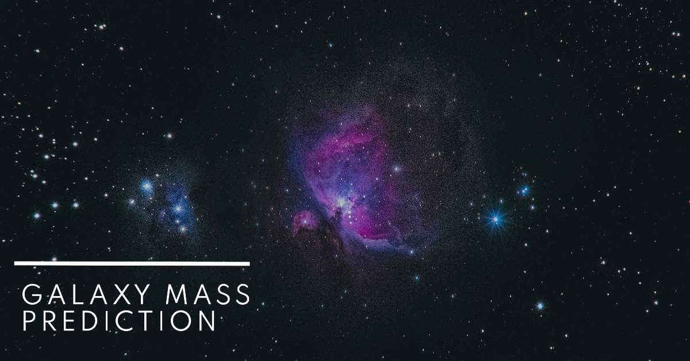

# 🌌 Galaxy Mass Prediction (Outlier Detection Project)

## 🪼 Introduction

This project focuses on developing a robust machine learning model to accurately predict the **mass of galaxies** based on observable properties like brightness from various bands and redshift. To enhance model performance, we'll be using effective outlier detection techniques.

## 🎯 Objective

- Develop a model that accurately predicts galaxy mass.
- Analyze the impact of outliers on model performance.
- Utilize probability distribution functions (PDFs) to explore outlier detection strategies.

## 🏗️ Methodology

1. **Data Collection** : You can find the kaggle data from this website: [Galaxy Mass Prediction Dataset](https://www.kaggle.com/datasets/mexwell/galaxy-mass-prediction?select=Buzzard_DC1.csv)

2. **Preprocessing & Feature Engineering** : Finding relevant features for the model prediction. In this case, the necessary features are provided having no null values which are captured through sensors.

3. **Identifying & Addressing the outliers** : Utilized statistical methods (e.g., IQR, Z-scores) to identify outliers and calculated through both the axis (0 and 1).

4. **Model Training & Evaluation** : Trained the linear regression model and evaluated the performance with R-squared metric. Iterated with different threshold values for outlier detection.

## Conclusion

The model achieved an accuracy of approximately 91% when including outliers. By removing 0.8% of outliers, we significantly improved performance to 95.5%. This clearly demonstrates the substantial impact of outliers on the model.

To further enhance accuracy, we can explore alternative regression models such as Decision Trees and Support Vector Regression.

